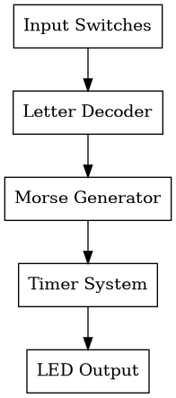
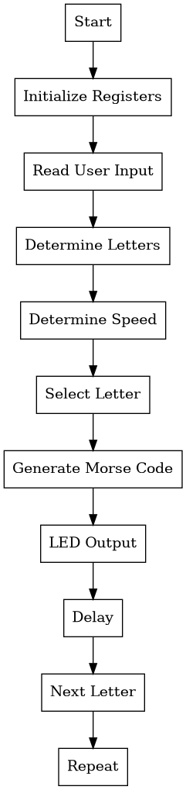
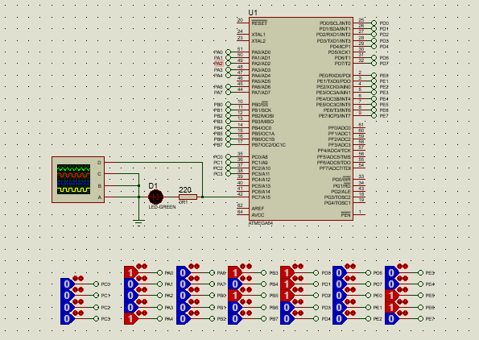
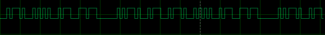

# ATmega64 Morse Code Generator

Microprocessor project developed using AVR Assembly language and simulated using Proteus.

---

## Project Overview

This project implements a Morse code generator using an ATmega64 microcontroller.

The system receives predefined user-selected characters and continuously displays their Morse code representation using an LED output and waveform display.

---

## Features

* Morse code generation
* User-selectable letters
* Adjustable timing modes
* LED output visualization
* Waveform output
* Timer0-based delay system
* Continuous message repetition

---

## Hardware Platform

* ATmega64
* LED
* Resistor
* Input switches
* Proteus

---

## Software

* AVR Assembly Language
* Timer0
* Port I/O

---

## System Architecture

---

## Flowchart

---

## Circuit Design

---

## Waveform Output

---

## LED Demonstration

---

## Timing Modes

### Slow Mode

### Fast Mode

---

## Project Structure

source/
Assembly source code

proteus/
Simulation files

docs/
Reports and calculations

screenshots/
Project images

diagrams/
Flowcharts and architecture

---

## Learning Outcomes

* AVR Assembly Programming
* Timer Configuration
* Embedded System Design
* State-Based Logic
* Microcontroller I/O Management

---

## Author

Farham Asgari
Computer Engineering Student
